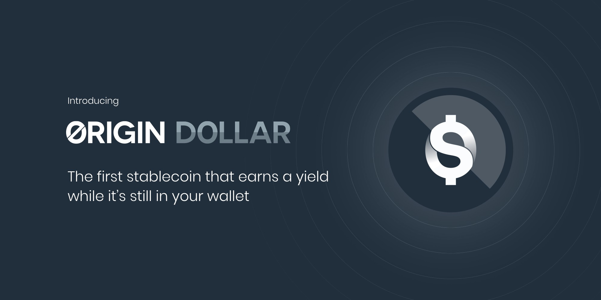

# 소개


Want to help improve these translations? [Volunteer!](https://goo.gl/PqT326)


## **A Better Form of Money**

Origin Dollar  \(OUSD \) 는 Ethereum 네트워크에서 2020 년 9 월에 처음 출시 된 새로운 스테이블코인\(stablecoin\) 입니다. Its design is superior to existing stablecoins because OUSD captures competitive yields while being passively held in wallets.

**배경**

1999 년 Origin의 R&D 엔지니어 인 Yu Pan과 그의 동료 PayPal 공동 창립자 [는 기존의 뱅킹 시스템에 연결하지 않고도 이자 수익률 전략과 직불 카드로 완성 된 "새로운 세계의 통화"를 만드는](https://www.cnbc.com/2017/08/14/david-sacks-cryptocurrency-interview.html) 것을 구상했습니다. 몇 차례의 피벗\(pivot\) 과 eBay 인수후, PayPal은 이 야망에서 멀어져 갔습니다.

거의 20 년 후 Tether는 2014 년에 USD로 표시된 스테이블코인 개념을 도입했습니다. 그 이후로 스테이블코인은 사용자에게 자유 유동성 통화의 가격 변동성에 노출되지 않고 가치를 이전하는 이상적인 방법으로 입증되었습니다. 오늘날 비트코인보다 Tether&lt;/a&gt;을 통해 전송되는 가치가

더 높습니다. 한편, 탈중앙화 금융  \(DeFi \)은 현재 대출 및 거래 프로토콜에서 수익을 창출하는 스마트 컨트렉트에 자본금이 [수십억 달러](https://defipulse.com/) 로 고정되어 폭발적인 성장을 경험했습니다.&lt;/p&gt;

기존 스테이블코인의 문제점 중 하나는 사용자가 쉽게 사용할 수있는 코인을 보유하는 것과 스마트 컨트렉트에 토큰을 락\(lock\) 해 수익을 얻는 것 중에서 끊임없이 선택해야한다는 것입니다. 예를 들어 Aave에서 USDC를 락\(lock\) 하는 사용자는 해당 USDC의 일부를 동시에 사용할 수 없습니다. 비싼 이더리움 가스 요금은 사용자가 지출 모드와 수입 모드 사이를 전환 할 때마다 생기는 "전환 비용" 역할을 합니다.

설상가상으로 대출 및 거래 활동으로 인한 수익률은 빠르게 변합니다. 정교한 DeFi 수익 창출자는 여러 경쟁 플랫폼에서 자산 포트폴리오를 지속적으로 재조정 하는것에 익숙합니다. 가스 요금은 다시 수확량을 낮추므로 시간과 비용이 많이 듭니다. 또한 APY가 불안정하고 지속적으로 변동하므로 실제 ROI를 계산하는데 시간이 많이 걸립니다. 쉬운 계정 단위\(unit of account\) 는 없습니다. 결과적으로 DeFi는 매우 빠르게 성장하고 있지만 여전히 많은 암호화폐 사용자가 참여하기 어렵습니다.

OUSD를 사용하려고 할 때 복잡한 포지션을 풀 필요가 없습니다. 지출 가능한 자본의 잠금을 해제하기 위해 가스를 지불하지 않고도 자유롭게 전송할 수 있습니다. 또한 OUSD는 번거로움없이 DeFi에서 가장 높은 수익을 올릴 수있는 기회를 제공합니다. The OUSD smart contract will deploy your underlying capital to a diversified set of yield-earning strategies, rebalancing over time to achieve great yields while diversifying risk. 수익은 지갑에 자동으로 누적되고 OUSD를 보유하는 동안 지속적으로 복리가 붙습니다. 다시 말하지만, 스테이킹\(staking\) 이나 락업\(lockup\) 이 필요하지 않습니다. OUSD는 이상적인 계정 단위\(unit of account\) 역할도 합니다. DeFi 투자자는 수익을 계산하기 위해 더 이상 복잡한 스프레드시트\(spreadsheet\) 가 필요하지 않습니다. 복리 이자가 자동으로 붙으면서 지속적으로 업데이트되는 OUSD 잔액을 실시간으로 쉽게 볼 수 있기 때문입니다. OUSD는 DeFi 이자 농부\(yield farmer\) 와 초보 암호화폐 사용자 모두에게 이상적인 스테이블코인입니다.

암호화폐 및 핀테크 베테랑이 만든 Origin Dollar는 연쇄 창업가, 초기 암호 화폐 투자자, YouTube의 초기 직원, Google / Dropbox의 엔지니어링 관리자, Paypal 중 하나를 포함하는 [Origin Protocol](https://www.originprotocol.com) 의 [팀](https://www.originprotocol.com/team) 에서 제공합니다. 공동 창립자, Yu Pan.

이 문서는 작동 방식에 대한 기술적 세부사항에 관심있는 사람들이 시작하기에 좋은 곳입니다. 개발자가 [Github](http://www.github.com/OriginProtocol)  \(100 % 오픈 소스 \)를 감사하고 기여하도록 권장합니다. 질문이 있거나 시작하는 데 도움이 필요한 경우 저희 팀이 많은 시간을 보내는 [Discord](https://www.originprotocol.com/discord)를 찾아주세요.

'미래의 돈'에 오신 것을 환영합니다.

