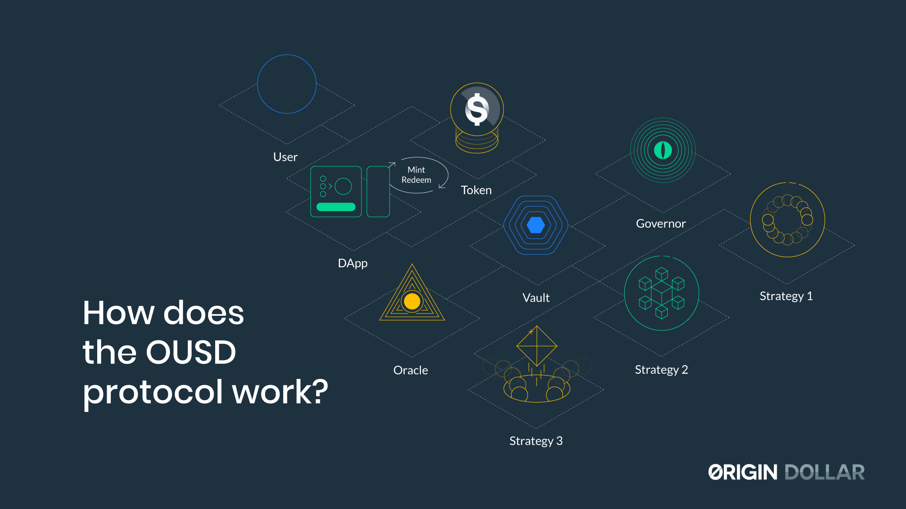

# Tổng quan

OUSD được tạo thành từ một loạt các hợp đồng thông minh. Mỗi hợp đồng này được bao bọc trong một hợp đồng ủy quyền có thể được nâng cấp thông qua các giao thức quản trị.

Xét về cơ chế bên trong, quyền sở hữu trong bể được theo dõi bằng hệ thống tín dụng thể hiện phần trăm quyền sở hữu của bể cho mỗi chủ sở hữu. Hợp đồng ERC-20 xử lý việc chuyển đổi sang USD khi dựa trên hoặc số tiền được chuyển giữa các ví.

Vault chịu trách nhiệm đào và đốt OUSD. Nó cũng chịu trách nhiệm phân bổ tài sản tới từng [Chiến lược](../core-concepts/supported-strategies/) được hỗ trợ. Để tối ưu hóa chi phí khí gas, vault tiền duy trì một bộ nhớ đệm để cho phép hầu hết các khoản tiền gửi và tiền hoàn lại diễn ra mà chuyển vào / chuyển ra khỏi các chiến lược.

