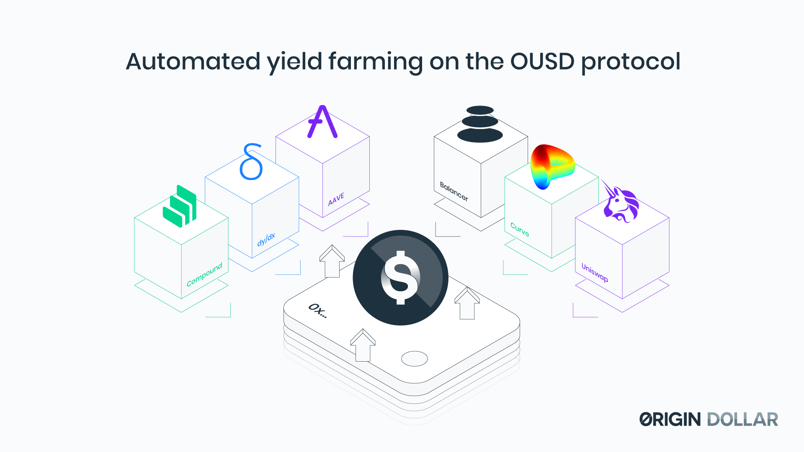

# Yield Generation

**Automated Yield Farming**

While the Cambrian explosion of new lending and automated market maker pools has fueled total value locked \(TVL\), it has also made it increasingly challenging for yield farmers to manually allocate capital in efficient and optimal ways.

[Yearn](https://yearn.finance/) has demonstrated that smart contracts can automate the rebalancing of funds across various strategies to optimally earn lending interest, market making fees, and rewards tokens. The first version of OUSD will employ a simple Compound strategy, but new strategies will be deployed every month that maximize returns while minimizing risk and dependencies.

Effectively, there are 3 ways that OUSD generates yield:







